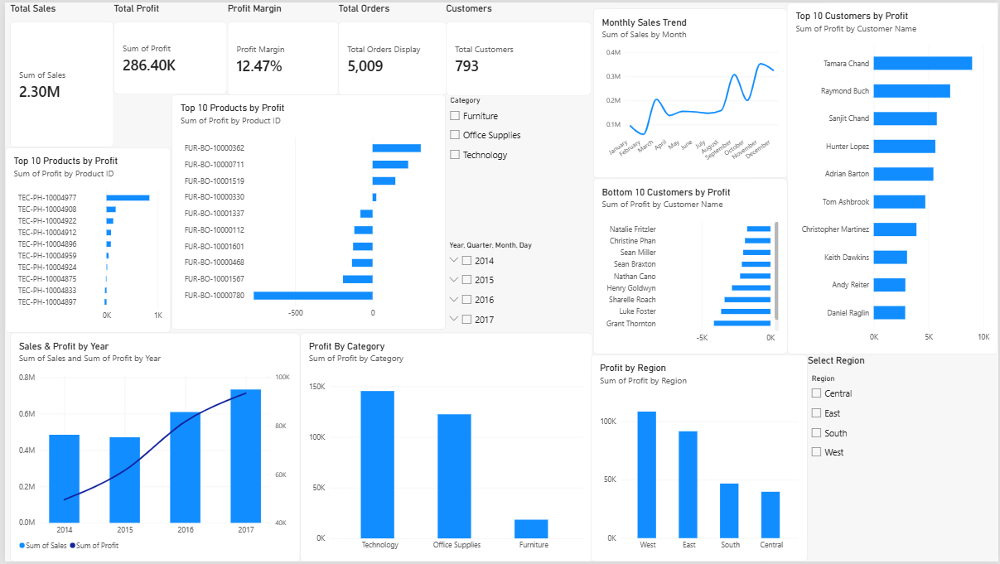
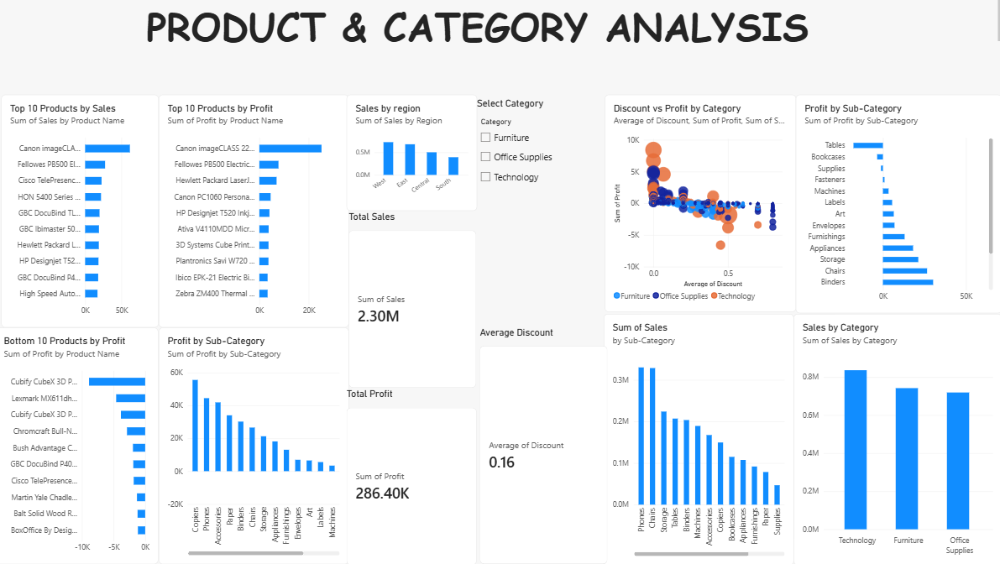
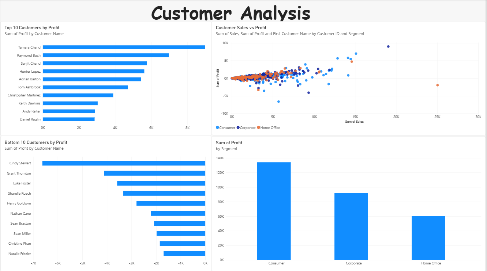
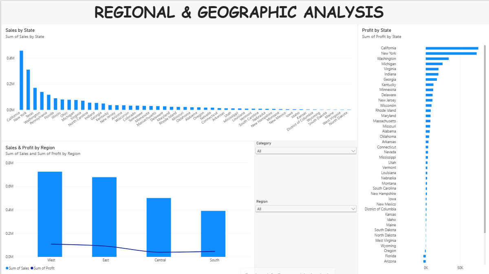

# Sales & Customer Analytics Dashboard

## 📌 Project Overview

This project analyzes sales, profit, customers, products, regions, and business performance using the Sample Superstore dataset.

The objective is to identify key business trends, profitable and loss-making areas, customer performance, product performance, and the impact of discounts on profitability.

The project combines **Python-based data analysis** with an interactive **Power BI dashboard** to transform raw sales data into actionable business insights.

---

## 🎯 Business Objectives

- Analyze overall sales and profitability
- Identify top-performing and loss-making products
- Analyze customer profitability and purchasing behavior
- Compare regional and geographic performance
- Analyze category and sub-category performance
- Evaluate customer segments
- Analyze shipping modes
- Study sales and profit trends over time
- Examine the relationship between discounts and profit
- Provide business recommendations based on the analysis

---

## 📊 Power BI Dashboard

The project includes an interactive Power BI dashboard divided into four analytical views.

### 1. Executive Overview



### 2. Product & Category Analysis



### 3. Customer Analysis



### 4. Regional & Geographic Analysis



---

## 🛠️ Tools & Technologies

- Python
- Pandas
- NumPy
- Microsoft Power BI
- DAX
- Power Query
- Microsoft Excel / CSV
- Data Visualization
- Exploratory Data Analysis (EDA)
- Git
- GitHub

---

## 📊 Key KPIs

| Metric | Value |
|---|---:|
| Total Sales | $2.30M |
| Total Profit | $286.40K |
| Profit Margin | 12.47% |
| Total Quantity | 37,873 |
| Unique Orders | 5,009 |
| Unique Customers | 793 |
| Unique Products | 1,862 |
| Average Order Value | $458.61 |
| Loss-Making Products | 301 |
| Loss-Making Customers | 155 |
| Loss-Making States | 10 |

---

## 📈 Dashboard Analysis

The Power BI dashboard provides an interactive view of business performance across multiple analytical dimensions.

### Executive Overview

- Overall Sales
- Total Profit
- Profit Margin
- Total Orders
- Total Customers
- Sales and Profit Trends
- Top 10 Products by Profit
- Top 10 Customers by Profit
- Bottom 10 Customers by Profit
- Profit by Category
- Profit by Region

### Product & Category Analysis

- Top 10 Products by Sales
- Top 10 Products by Profit
- Bottom 10 Products by Profit
- Sales by Category
- Profit by Category
- Sales by Sub-Category
- Profit by Sub-Category
- Discount Analysis
- Discount vs Profit Analysis
- Regional Performance

### Customer Analysis

- Top 10 Customers by Profit
- Bottom 10 Customers by Profit
- Customer Sales vs Profit
- Customer Segment Performance
- Customer Profitability Analysis

### Regional & Geographic Analysis

- Regional Sales and Profit
- Sales by State
- Profit by State
- State-Level Performance
- Regional Filtering
- Category Filtering

---

## 🔍 Key Business Insights

- Total sales generated were approximately **$2.30M**, with total profit of approximately **$286.40K**.
- The overall profit margin was approximately **12.47%**.
- **Technology** generated the highest sales among the three major categories.
- The **West region** generated the highest overall sales.
- The **Consumer segment** contributed the highest sales and profit.
- A significant number of products and customers generated negative profit.
- **301 products** were identified as loss-making.
- **155 customers** were identified as loss-making.
- **10 states** recorded an overall negative profit.
- The analysis identified a negative relationship between discount and profit, indicating that higher discounts can negatively affect profitability.
- Customer-level analysis revealed a small group of highly profitable customers as well as customers generating significant losses.

---

## 💡 Business Recommendations

### 1. Control Excessive Discounts

Review high-discount transactions and introduce discount limits for products or customer groups where discounts significantly reduce profitability.

### 2. Review Loss-Making Products

Investigate pricing, discounts, shipping costs, and demand for products generating repeated losses.

### 3. Improve Customer Profitability

Identify loss-making customers and analyze their purchasing patterns before offering additional discounts or promotions.

### 4. Focus on High-Performing Categories

Prioritize profitable categories and sub-categories while improving the performance of weaker product areas.

### 5. Investigate Underperforming Locations

Analyze loss-making states and cities to identify pricing, product mix, or discount-related issues.

### 6. Strengthen High-Value Customer Relationships

Develop targeted retention and cross-selling strategies for highly profitable customers.

---

## 🐍 Python Analysis

Python was used for:

- Data loading and cleaning
- Data validation
- Exploratory Data Analysis
- KPI calculation
- Category analysis
- Regional analysis
- Customer analysis
- Product analysis
- Geographic analysis
- Profitability analysis
- Discount analysis
- Performance segmentation
- Analytical output generation

The Python scripts are available in the `python/` folder.

---

## 📁 Project Structure

```text
Sales_Customer_Analytics/
│
├── data/
│   ├── Sample - Superstore.csv
│   └── cleaned_superstore.csv
│
├── outputs/
│   ├── city_analysis.csv
│   ├── customer_analysis.csv
│   ├── kpi_summary.csv
│   ├── output_city_quadrants.csv
│   ├── output_customer_analysis.csv
│   ├── output_product_analysis.csv
│   ├── product_analysis.csv
│   ├── region_analysis.csv
│   ├── segment_analysis.csv
│   ├── state_analysis.csv
│   └── subcategory_analysis.csv
│
├── python/
│   ├── 01_load_data.py
│   └── 02_eda_analysis.py
│
├── screenshots/
│   ├── 01_Executive_Overview.png
│   ├── 02_Product_Category_Analysis.png
│   ├── 03_Customer_Analysis.png
│   └── 04_Regional_Geographic_Analysis.png
│
├── Dashboard.pbix
├── requirements.txt
├── README.md
└── .gitignore